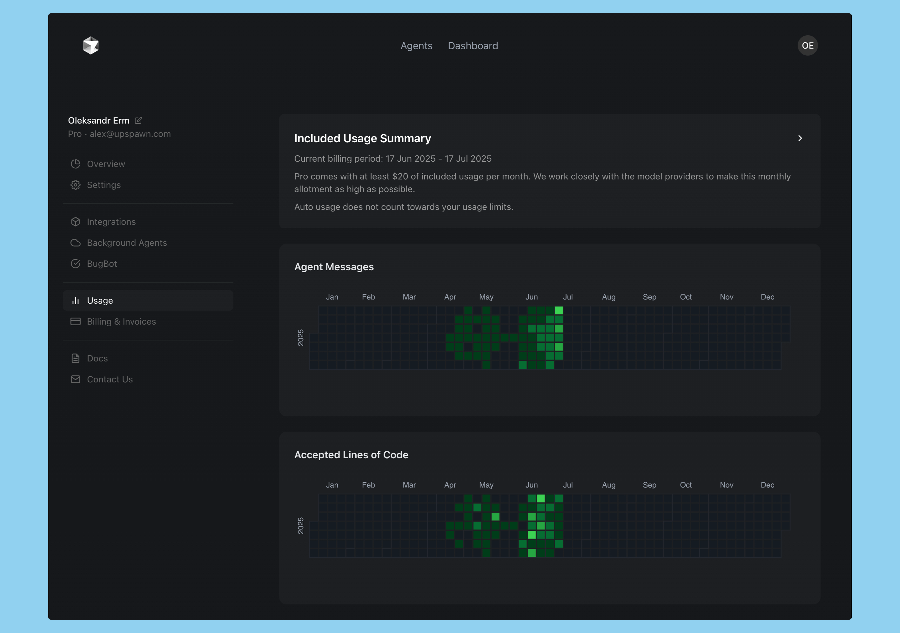

# Cursor Stats Extension

[](https://chromewebstore.google.com/detail/cursor-stats/fdlfealdpfjfjnadhdobllmondagkcal)
[](LICENSE)

## Overview

**Cursor Stats Extension** is a browser extension that visualizes your activity on Cursor. It provides interactive charts and calendars to help you track agent messages, accepted code suggestions, and token usage over time. This tool is designed to help developers understand and optimize their productivity within the Cursor environment.

## Features

- 📊 **Agent Messages Calendar:** Visualize your daily AI chat requests.
- ✅ **Accepted Lines Calendar:** Track accepted code suggestions over time.
- 🔢 **Token Usage Bar Chart:** Monitor your token consumption for the last 30 days.
- ⚡ **Live Data Fetching:** Progressively loads and updates your usage data.
- 🎨 **Modern UI:** Clean, dark-themed dashboard for easy insights.

## Screenshots



## 🚀 Quick Install

**[Install from Chrome Web Store →](https://chromewebstore.google.com/detail/cursor-stats/fdlfealdpfjfjnadhdobllmondagkcal)**

*One-click installation - no setup required!*

---

## Alternative Installation Methods

<details>
<summary>📦 Manual Installation (for developers)</summary>

1. **Clone the repository:**

   ```sh
   git clone git@github.com:alexerm/cursor-stats-extension.git
   cd cursor-stats-extension
   ```

2. **Install dependencies:**

   ```sh
   pnpm install
   # or
   npm install
   ```

3. **Build the extension:**

   ```sh
   pnpm build
   # or
   npm run build
   ```

4. **Load into your browser:**
   - Open your browser's extensions page.
   - Enable "Developer mode".
   - Click "Load unpacked" and select the `dist` or `build` directory.

</details>

## Usage

- Open the extension popup to view your activity dashboard.
- The extension fetches your Cursor analytics and usage data automatically.
- Hover over charts for detailed statistics.

## Contributing

Contributions are welcome! Please open issues or pull requests for new features, bug fixes, or suggestions.

1. Fork the repository
2. Create your feature branch (`git checkout -b feature/YourFeature`)
3. Commit your changes (`git commit -am 'Add new feature'`)
4. Push to the branch (`git push origin feature/YourFeature`)
5. Open a pull request

## License

This project is licensed under the [MIT License](LICENSE).

---

**Author:** Oleksandr Erm (<alexerm@gmail.com>)
